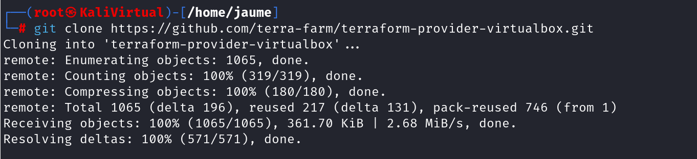
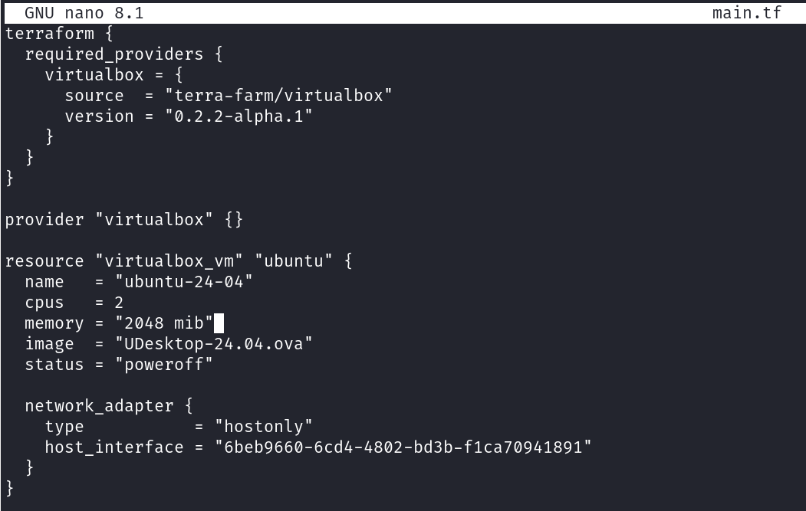
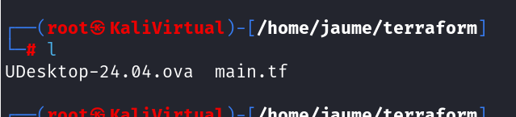
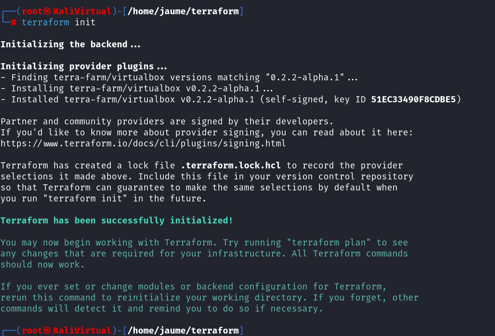
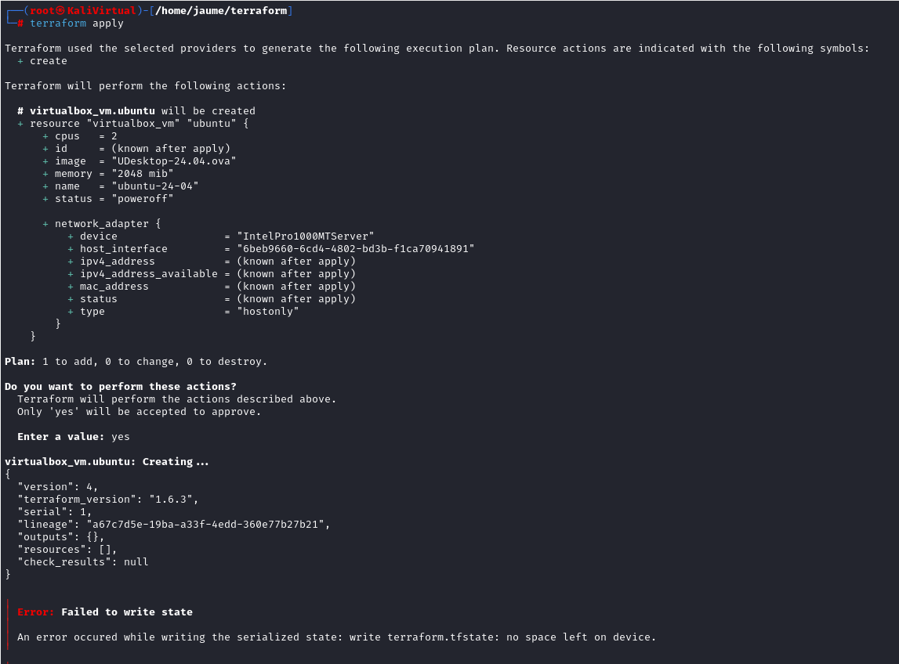

# TERRAFORM_ANSIBLE

Actividad de terraform

En esta práctica he utilizado Terraform junto a VirtualBox para crear una máquina virtual con Ubuntu 24.04 a partir de un archivo .ova. 

Requisitos previos

Antes de comenzar, he tenido que asegurarme de tener instalado lo siguiente en mi máquina Kali :

- VirtualBox
- Terraform
- Archivo .ova válido (en mi caso, UDesktop-24.04.ova)
- Provider de VirtualBox para Terraform

Instalación del provider de VirtualBox para Terraform

Terraform no tiene un proveedor oficial para VirtualBox, así que he utilizado el proveedor no oficial terra-farm/virtualbox.

Primero, clono el repositorio del provider:

Después de eso, he creado un directorio para trabajar con Terraform y he generado el archivo main.tf, donde defino cómo quiero que sea mi máquina virtual.

Este fichero define el proveedor, la VM que quiero levantar, los recursos que le asigno (CPU, memoria), y el adaptador de red en modo "hostonly". También le paso la imagen .ova desde la que debe desplegarse.

Para instalar el provider correctamente, es necesario inicializar Terraform dentro del directorio:

Una vez inicializado el entorno, he ejecutado init:

Terraform ha comenzado el proceso y ha llegado a mostrar los cambios que iba a realizar. Sin embargo, durante la ejecución ha fallado por falta de espacio en disco. 
Esto se debe a que estoy trabajando desde una máquina virtual, y el archivo .ova más los recursos necesarios exceden el espacio disponible.

Si no hubiese tenido problemas de espacio, Terraform habría creado la máquina virtual ubuntu-24-04 en VirtualBox con las características especificadas. Este proceso automatiza el despliegue y habría resultado en una VM lista

